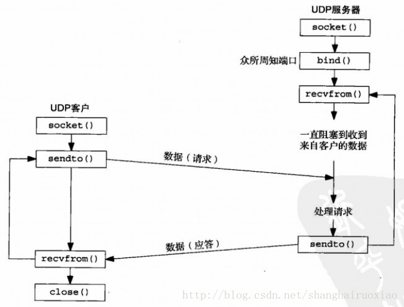

# C和C++语言基础 #
- extern关键字作用：extern可以置于变量或者函数前，以标示变量或者函数的定义在别的文件中，提示编译器遇到此变量和函数时在其他模块中寻找其定义。此外extern也可用来进行链接指定。 
- static关键字作用
	1. static修饰局部变量：使得被修饰的变量成为静态变量，存储在静态区。存储在静态区的数据生命周期与程序相同，在main函数之前初始化，在程序退出时销毁。（无论是局部静态还是全局静态）
	2. 全局变量本来就存储在静态区，因此static并不能改变其存储位置。但是，static限制了其链接属性。被static修饰的全局变量只能被该包含该定义的文件访问。
	3. static修饰函数使得函数只能在包含该函数定义的文件中被调用。在头文件b.h中声明静态函数fun()，在文件b.cpp中定义静态函数fun()，编译器会报错，指明b.h中的fun函数未定义。 对于静态函数，声明和定义需要放在同一个文件夹中。
	4. 在C++中static不光具备C中所有的作用，而且对于静态成员变量和静态成员函数。所有的对象都只维持同一个实例。 因此，采用static可以实现不同对象之间数据共享。
- volatile是干啥的
	1. 访问寄存器要比访问内存要块，因此CPU会优先访问该数据在寄存器中的存储结果，但是内存中的数据可能已经发生了改变，而寄存器中还保留着原来的结果。为了避免这种情况的发生将该变量声明为volatile，告诉CPU每次都从内存去读取数据。
	2. 一个参数可以即是const又是volatile的吗？可以，一个例子是只读状态寄存器，是volatile是因为它可能被意想不到的被改变，是const告诉程序不应该试图去修改他。
- 说说const的作用，越多越好
	1.  const修饰全局变量；
	2.  const修饰局部变量；
	3.  const修饰指针，const int *；
	4.  const修饰指针指向的对象, int * const；
	5.  const修饰引用做形参；
	6.  const修饰成员变量，必须在构造函数列表中初始化；
	7.  const修饰成员函数，说明该函数不应该修改非静态成员，但是这并不是十分可靠的，指针所指的非成员对象值可能会被改变
- new与malloc区别
	1. new分配内存按照数据类型进行分配，malloc分配内存按照大小分配；
	2. new不仅分配一段内存，而且会调用构造函数，但是malloc则不会。new的实现原理？但是还需要注意的是，之前看到过一个题说int* p = new int与int* p = new int()的区别，因为int属于C++内置对象，不会默认初始化，必须显示调用默认构造函数，但是对于自定义对象都会默认调用构造函数初始化。翻阅资料后，在C++11中两者没有区别了，自己测试的结构也都是为0；
	3. new返回的是指定对象的指针，而malloc返回的是void*，因此malloc的返回值一般都需要进行类型转化；
	4. new是一个操作符可以重载，malloc是一个库函数；
	5. new分配的内存要用delete销毁，malloc要用free来销毁；delete销毁的时候会调用对象的析构函数，而free则不会；
	6. malloc分配的内存不够的时候，可以用realloc扩容。扩容的原理？new没用这样操作；
	7. new如果分配失败了会抛出bad_malloc的异常，而malloc失败了会返回NULL。因此对于new，正确的姿势是采用try…catch语法，而malloc则应该判断指针的返回值。为了兼容很多c程序员的习惯，C++也可以采用new nothrow的方法禁止抛出异常而返回NULL；
	8. new和new[]的区别，new[]一次分配所有内存，多次调用构造函数，分别搭配使用delete和delete[]，同理，delete[]多次调用析构函数，销毁数组中的每个对象。而malloc则只能sizeof(int) * n；
- C++多态性与虚函数表
	1. C++多态的实现:多态分为静态多态和动态多态。静态多态是通过重载和模板技术实现，在编译的时候确定。动态多态通过虚函数和继承关系来实现，执行动态绑定，在运行的时候确定。 动态多态实现有几个条件：(1) 虚函数； (2) 一个基类的指针或引用指向派生类的对象； 基类指针在调用成员函数(虚函数)时，就会去查找该对象的虚函数表。虚函数表的地址在每个对象的首地址。查找该虚函数表中该函数的指针进行调用。 每个对象中保存的只是一个虚函数表的指针，C++内部为每一个类维持一个虚函数表，该类的对象的都指向这同一个虚函数表。虚函数表中为什么就能准确查找相应的函数指针呢？因为在类设计的时候，虚函数表直接从基类也继承过来，如果覆盖了其中的某个虚函数，那么虚函数表的指针就会被替换，因此可以根据指针准确找到该调用哪个函数。
	2. 虚函数的作用？虚函数用于实现多态，但是虚函数在设计上还具有封装和抽象的作用。比如抽象工厂模式。
	3. 动态绑定是如何实现的？ 第一个问题中基本回答了，主要都是结合虚函数表来答就行。
- 纯虚函数如何定义，为什么对于存在虚函数的类中析构函数要定义成虚函数
	为了实现多态进行动态绑定，将派生类对象指针绑定到基类指针上，对象销毁时，如果析构函数没有定义为析构函数，则会调用基类的析构函数，显然只能销毁部分数据。如果要调用对象的析构函数，就需要将该对象的析构函数定义为虚函数，销毁时通过虚函数表找到对应的析构函数。
- 析构函数能抛出异常吗 
	答案肯定是不能。C++标准指明析构函数不能、也不应该抛出异常。C++异常处理模型最大的特点和优势就是对C++中的面向对象提供了最强大的无缝支持。那么如果对象在运行期间出现了异常，C++异常处理模型有责任清除那些由于出现异常所导致的已经失效了的对象(也即对象超出了它原来的作用域)，并释放对象原来所分配的资源， 这就是调用这些对象的析构函数来完成释放资源的任务，所以从这个意义上说，析构函数已经变成了异常处理的一部分。
- 构造函数和析构函数中调用虚函数吗？
不能，构造函数执行的时候，派生类可能还没好。析构函数执行的时候可能派生类一部分已经销毁了。
- 指针和引用的区别
	1. 指针保存的是所指对象的地址，引用是所指对象的别名，指针需要通过解引用间接访问，而引用是直接访问；
	2. 指针可以改变地址，从而改变所指的对象，而引用必须从一而终；
	3. 引用在定义的时候必须初始化，而指针则不需要；
	4. 指针有指向常量的指针和指针常量，而引用没有常量引用；
	5. 指针更灵活，用的好威力无比，用的不好处处是坑，而引用用起来则安全多了，但是比较死板。
- 指针与数组千丝万缕的联系
	1. 一个一维int数组的数组名实际上是一个int* const 类型；
	2. 一个二维int数组的数组名实际上是一个int (*const p)[n];
	3. 数组名做参数会退化为指针，除了sizeof
- 智能指针是怎么实现的？什么时候改变引用计数？
	1. 构造函数中计数初始化为1；
	2. 拷贝构造函数中计数值加1；
	3. 赋值运算符中，左边的对象引用计数减一，右边的对象引用计数加一；
	4. 析构函数中引用计数减一；
	5. 在赋值运算符和析构函数中，如果减一后为0，则调用delete释放对象。
- C++四种类型转换：static_cast, dynamic_cast, const_cast, reinterpret_cast
	1. const_cast用于将const变量转为非const
	2. static_cast用的最多，对于各种隐式转换，非const转const，void*转指针等, static_cast能用于多态想上转化，如果向下转能成功但是不安全，结果未知；
	3. dynamic_cast用于动态类型转换。只能用于含有虚函数的类，用于类层次间的向上和向下转化。只能转指针或引用。向下转化时，如果是非法的对于指针返回NULL，对于引用抛异常。要深入了解内部转换的原理。
	4. reinterpret_cast几乎什么都可以转，比如将int转指针，可能会出问题，尽量少用；
	5. 为什么不使用C的强制转换？C的强制转换表面上看起来功能强大什么都能转，但是转化不够明确，不能进行错误检查，容易出错。
- 内存对齐的原则
	1. 从0位置开始存储；
	2. 变量存储的起始位置是该变量大小的整数倍；
	3. 结构体总的大小是其最大元素的整数倍，不足的后面要补齐；
	4. 结构体中包含结构体，从结构体中最大元素的整数倍开始存；
	5. 如果加入pragma pack(n) ，取n和变量自身大小较小的一个。
- 内联函数有什么优点？内联函数与宏定义的区别？
	1. 宏定义在预编译的时候就会进行宏替换；
	2. 内联函数在编译阶段，在调用内联函数的地方进行替换，减少了函数的调用过程，但是使得编译文件变大。因此，内联函数适合简单函数，对于复杂函数，即使定义了内联编译器可能也不会按照内联的方式进行编译。
	3. 内联函数相比宏定义更安全，内联函数可以检查参数，而宏定义只是简单的文本替换。因此推荐使用内联函数，而不是宏定义。
	4. 使用宏定义函数要特别注意给所有单元都加上括号，#define MUL(a, b) a * b，这很危险，正确写法：#define MUL(a, b) ((a) * (b))
- C++内存管理
	1. C++内存分为那几块？（堆区，栈区，常量区，静态和全局区）
	2. 每块存储哪些变量？
- STL里的内存池实现 
	STL内存分配分为一级分配器和二级分配器，一级分配器就是采用malloc分配内存，二级分配器采用内存池。
	二级分配器设计的非常巧妙，分别给8k，16k,…, 128k等比较小的内存片都维持一个空闲链表，每个链表的头节点由一个数组来维护。需要分配内存时从合适大小的链表中取一块下来。假设需要分配一块10K的内存，那么就找到最小的大于等于10k的块，也就是16K，从16K的空闲链表里取出一个用于分配。释放该块内存时，将内存节点归还给链表。 
	如果要分配的内存大于128K则直接调用一级分配器。 
	为了节省维持链表的开销，采用了一个union结构体，分配器使用union里的next指针来指向下一个节点，而用户则使用union的空指针来表示该节点的地址。
- STL里set和map是基于什么实现的。红黑树的特点？
	1. set和map都是基于红黑树实现的。
	2. 红黑树是一种平衡二叉查找树，与AVL树的区别是什么？AVL树是完全平衡的，红黑树基本上是平衡的。
	3. 为什么选用红黑数呢？因为红黑数是平衡二叉树，其插入和删除的效率都是N(logN)，与AVL相比红黑数插入和删除最多只需要3次旋转，而AVL树为了维持其完全平衡性，在坏的情况下要旋转的次数太多。 
	4. 红黑树的定义： 
	(1) 节点是红色或者黑色； 
	(2) 父节点是红色的话，子节点就不能为红色； 
	(3) 从根节点到每个页子节点路径上黑色节点的数量相同； 
	(4) 根是黑色的，NULL节点被认为是黑色的。
- STL里的其他数据结构和算法实现也要清楚 
- 必须在构造函数初始化式里进行初始化的数据成员有哪些 
	1. 常量成员，因为常量只能初始化不能赋值，所以必须放在初始化列表里面 
	2. 引用类型，引用必须在定义的时候初始化，并且不能重新赋值，所以也要写在初始化列表里面 
	3. 没有默认构造函数的类类型，因为使用初始化列表可以不必调用默认构造函数来初始化，而是直接调用拷贝构造函数初始化
- 模板特化 
- 定位内存泄露 
- 手写strcpy

```
char* strcpy(char* dst, const char* src)
{
    assert(dst);
    assert(src);
    char* ret = dst;
    while((*dst++ = *src++) != '\0');
    return ret;
}
//该函数是没有考虑重叠的

char* strcpy(char* dst, const char* src)
{
    assert((dst != NULL) && (src != NULL));
    char* ret = dst;
    int size = strlen(src) + 1;
    if(dst > src || dst < src + len)
    {
        dst = dst + size - 1;
        src = src + size - 1;
        while(size--)
        {
            *dst-- = *src--;
        }
    }
    else
    {
        while(size--)
        {
            *dst++ = *src++;
        }
    }
    return ret;
}
```
- 手写memcpy函数

```
void* memcpy(void* dst, const void* src, size_t size)
{
    if(dst == NULL || src == NULL)
    {
        return NULL;
    }
    void* res = dst;
    char* pdst = (char*)dst;
    char* psrc = (char*)src;

    if(pdst > psrc && pdst < psrc + size) //重叠
    {
        pdst = pdst + size - 1;
        psrc = pdst + size - 1;
        while(size--)
        {
            *pdst-- = *psrc--;
        }
    }
    else //无重叠
    {
        while(size--)
        {
            *dst++ = *src++;
        }
    }
    return ret;
}
```
- 手写strcat函数

```
char* strcat(char* dst, const char* src)
{
    char* ret = dst;

    while(*dst != '\0')
        ++dst;

    while((*dst++ = *src) != '\0');
    return ret;
}
```
- 手写strcmp函数

```
int strcmp(const char* str1, const char* str2)
{

    while(*str1 == *str2 && *str1 != '\0')
    {
        ++str1;
        ++str2;
    }
    return *str1 - *str2;
}
```

# 数据结构与算法 #
## Hash表 ##
- Hash表实现（拉链和分散地址）
- Hash策略常见的有哪些？
- STL中hash_map扩容发生什么？ 
	1. 创建一个新桶，该桶是原来桶两倍大最接近的质数(判断n是不是质数的方法：用n除2到sqrt(n)范围内的数) ； 
	2. 将原来桶里的数通过指针的转换，插入到新桶中(注意STL这里做的很精细，没有直接将数据从旧桶遍历拷贝数据插入到新桶，而是通过指针转换) 
	3. 通过swap函数将新桶和旧桶交换，销毁新桶。

## 树 ##
- 二叉树结构，二叉查找树实现；
- 二叉树的六种遍历；
- 二叉树的按层遍历；
- 递归是解决二叉树相关问题的神级方法；
- Trie树(字典树)
	1. 每个节点保存一个字符
	2. 根节点不保存字符
	3. 每个节点最多有n个子节点(n是所有可能出现字符的个数)
	4. 查询的复杂父为O(k)，k为查询字符串长度

## 链表 ##
- 链表和插入和删除，单向和双向链表都要会
- 链表的问题考虑多个指针和递归 
	1. 反向打印链表(递归) 
	2. 打印倒数第K个节点(前后指针) 
	3. 链表是否有环(快慢指针)等等。b ggg

## 栈和队列 ##
队列和栈的区别？(从实现，应用，自身特点多个方面来阐述，不要只说一个先入先出，先入后出，这个你会别人也会，要展现出你比别人掌握的更深)

## 海量数据问题 ##
十亿整数（随机生成，可重复）中前K最大的数 
类似问题的解决方法思路：首先哈希将数据分成N个文件，然后对每个文件建立K个元素最小/大堆（根据要求来选择）。最后将文件中剩余的数插入堆中，并维持K个元素的堆。最后将N个堆中的元素合起来分析。可以采用归并的方式来合并。在归并的时候为了提高效率还需要建一个N个元素构成的最大堆，先用N个堆中的最大值填充这个堆，然后就是弹出最大值，指针后移的操作了。当然这种问题在现在的互联网技术中，一般就用map-reduce框架来做了。 
大数据排序相同的思路：先哈希（哈希是好处是分布均匀，相同的数在同一个文件中），然后小文件装入内存快排，排序结果输出到文件。最后建堆归并。

## 排序算法 ##

## 位运算 ##

## 布隆过滤器 ##

# 网络与TCP/IP #
## TCP与UDP之间的区别  ##
-  TCP与UDP之间的区别 
	1. TCP基于有连接，UDP基于无连接。有连接就是TCP在传输前先发送连接请求和应答包，确定双方能够正常传输后，才开始进行数据传输。无连接就是UDP在发送数据之前，并不考虑对方能否接受到，甚至目的地址可能都是无效；
	2. TCP能保证可靠传输，UDP不能保证可靠传输TCP。所谓可靠就是TCP能保证把数据一定送到目的地址。为了实现可靠，TCP采用有连接的，超时重传，应答机制等。而UDP则没有这些，也不能保证数据一定能送到；
	3. TCP结构复杂，消耗资源多，建立过程较慢较复杂。UDP结构简单，消耗资源少，建立过程较快；
	4. TCP基于流模式，UDP是数据报模式。TCP把数据看成一连串无结构的字节流，没有边界，一段段传输构成了整个数据块。通过发送缓冲区和接受缓冲区来存储数据流。而UDP数据报模式，每一个数据报都是一个独立的对象，有着指定的大小。
	5. TCP连接只能是点到点，而UDP可以一对一，一对多或者多对多。TCP只能是点到点原因很简单，因为TCP的传输前要先建立连接。因此，广播和多播只能采用UDP数据报的方式。
	6. TCP有确认，重传，拥赛控制机制，UDP在没有建立连接或者对方已经退出的情况下任然会继续发送数据，导致通信流量的浪费。
- TCP三次握手与四次挥手

## TCP三次握手与四次挥手 ##
- 建立连接
	1. 客户端发送请求包，告诉服务器：“我想和你通信？”数据包中SYN位置为1，假设其序列号为x，客户端状态变成SYN_SENT；
	2. 服务器端接受到请求包后也发送一个请求包，告诉客户端：“现在可以建立连接”。数据包中SYN位置位1，假设其序列号为y，注意客户端序列号和服务器端序列号并没有关系，他们是由各自的内核按照一定的规则生成的。但是这个应答包的32位应答号，必须是x+1，之所以加1是因为客户端发过来的包SYN位被认为占一个数据。因此，告诉下一包从x+1开始发。发送后，服务器从监听状态变成SYN_RCVD状态。
	3. 客户端发送应答数据包，告诉服务器：“那我们开始发送数据吧”。数据包应答号为y+1。客户端变成ESTABLISHED状态，即可以传输状态。
	4. 服务器端接受到应答数据包后，变成ESTABLISHED状态。
- 为什么是3次
	可能你会认为第3次好像是多余的。是因为信道是不可靠的，可能存在延时或者丢包，而三次是满足可靠传输的最小次数。

	举例说明：如果只有两次，假设主机A发送的第一个请求包延时，主机A在等待一段时间后重新发送一个请求包，完成数据连接并断开。但是这个时候上次的发的请求包才到达主机B，这时主机B认为是又一次连接，因此发送一个请求包给A，但是Ａ并没有发送新的请求因此会丢失该数据包。最后，B就一直等待A发送数据，浪费了资源。
- 为什么是4次
	TCP通信是一种全双工的通信，可以进行半关闭（与半打开区别：半打开是连接后的客户端和服务端有一端异常关闭了），所谓半关闭是指可以只关闭从A到B的方向，而B到A的方向还可以继续传输。因此，在客户端和服务器端分别进行关闭。


- 发送数据
	1. 客户端发送一个一个字节的数据，因此序列号为x+1；
	2. 服务端发送一个应答包，应答号为x+2，告诉客户端下次从x+2开始发；
- 断开连接
	1. 客户端发送请求断开的数据包，告诉服务器：“数据传完了，我要断开了”。发送一个FIN包，序列号x+2。客户端转移到FIN_WAIT_1状态。
	2. 服务器端发送应答包，告诉客户端：“行，我知道了，你断开吧！”。应答号为x+3，服务器进入CLOSE_WAIT状态。客户端收到应答后，转移到FIN_WAIT_2状态。
	3. 服务器发送一个断开数据包，告诉客户端：“既然传完了，那我这边的开关也准备关了”。序列号为y+1，发送完后服务器进入LAST_ACK状态。
	4. 客户端发送一个应答包，告诉服务器：“好的，我知道你要断开了。”应答号为y+2。客户端进入TIME_WAIT状态。 
	TIME_WAIT又称为2MSL等待状态，MSL是系统中定义的最大报文生存时间，任何TCP报文在网络中生存时间超过这个值就必须被丢弃。 
	等待MSL的原因是防止最后一个ACK丢失后可以进行重发，如果ACK丢失后，服务器会重发FIN。

## 详细说明TCP状态迁移过程  ##

## TCP相关技术 ##

## TCP客户与服务器模型，用到哪些函数 ##
- TCP服务器端
	1. 创建套接字

	```
	 #include <sys/socket.h>
 	int socket(int family,int type,int protocol); 　　　
  　　 　返回：非负描述字－－－成功　　　-1－－－失败
	```
	第一个参数指明了协议簇，目前支持5种协议簇，最常用的有AF_INET(IPv4协议)和AF_INET6(IPv6协议)；第二个参数指明套接口类型，有三种类型可选：SOCK_STREAM(字节流套接口)、SOCK_DGRAM(数据报套接口)和SOCK_RAW(原始套接口)；如果套接口类型不是原始套接口，那么第三个参数就为0。
	2. 绑定套接字 
	把一个套接字地址（本机IP和端口号）绑定到创建的套接字上。绑定套接字时可以选择指定IP地址和端口，也可以不指定。通配的IP地址用INADDR_ANY表示，通配的端口用0表示，通配的情况下由内核为其指定相应的IP地址和端口号。 
	```
	#include <sys/socket.h> 　
	int bind(int sockfd, const struct sockaddr * server, socklen_t addrlen);
 	返回：0－－－成功　　　-1－－－失败
	```
	3. 监听:socket创建的套接字是主动套接字，调用listen后变成监听套接字。TCP状态有CLOSE跃迁到LISTEN状态。
	```
	#include<sys/socket.h>
	int listen(int sockfd, int backlog);
	```
	4. accept函数 
	accept函数从已完成连接的队列中取走一个套接字，如果该队列为空，则accept函数阻塞。accept函数的返回值称为已连接套接字，已连接的套接字就建立一个完整的TCP连接，源IP地址，源端口号，目的IP地址，目的端口号都是唯一确定了。
	```
	#include <sys/socket.h> 　　 　 　 　
	int accept(int listenfd, struct sockaddr *client, socklen_t * addrlen); 　
	```
	5. 数据传输
	write和read函数：当服务器和客户端的连接建立起来后，就可以进行数据传输了，服务器和客户端用各自的套接字描述符进行读/写操作。因为套接字描述符也是一种文件描述符，所以可以用文件读/写函数write()和read()进行接收和发送操作。
	write()函数用于数据的发送
	```
	#include <unistd.h> 　　 　 　 　
 	int write(int sockfd, char *buf, int len);　
  	回：非负－－－成功　　　-1－－－失败
	#include <unistd.h> 　　 　 　 　
 	int read(int sockfd, char *buf, intlen); 　
  	回：非负－－－成功　　　-1－－－失败
	```
	6. 关闭套接字 
- TCP客户端
	1. 创建套接字 
	2. 连接服务器 
	TCP用connect函数来建立与TCP服务器的连接。
	```
	#include <sys/socket.h>　　 　 　
 	int connect(int sockfd, const struct sockaddr * addr, socklen_t addrlen); 　
 	返回：0－－－成功　　　-1－－－失败
	```
	3. 收发数据 
	4. 关闭套接字
## UDP客户与服务器模型，用到哪些函数 ##

- socket函数创建套接字

```
#include <sys/types.h>
#include <sys/socket.h>
sockfd = socket(AF_INET, SOCK_DGRAM, 0)；
```
UDP是数据报的形式，因此在创建套接字时，是SOCK_DGRAM，这是与TCP不同的地方。
- bind函数，绑定服务器地址到套接字上

```
#include <sys/types.h>          /* See NOTES */
#include <sys/socket.h>
int bind(int sockfd, const struct sockaddr *addr, socklen_t addrlen);
```
bind函数与TCP的使用相同，将服务器的知名端口号和IP地址绑定到服务器套接字地址上，IP地址可能有多个。
- sendto函数，发送数据给指定地址

```
#include <sys/types.h>
#include <sys/socket.h>

ssize_t sendto(int sockfd, const void *buf, size_t len, int flags, const struct sockaddr *dest_addr, socklen_t addrlen);
```
sendto函数比send函数多出两个参数，一个是目的地址，一个是地址长度。告诉客户端发送给哪个IP地址和哪个端口号。

- recvfrom函数，接收数据

```
#include <sys/types.h>
#include <sys/socket.h>
ssize_t recvfrom(int sockfd, void *buf, size_t len, int flags, struct sockaddr *src_addr, socklen_t *addrlen);
```
recvfrom函数比recv函数多出两个参数，相当于TCP的accept函数，告诉我们是谁发送了数据过来。
## 域名解析过程，ARP的机制，RARP的实现 ##

## Ping和TraceRoute实现原理 ##

## HTTP ##

# 数据库 #
- SQL语言(内外连接，子查询，分组，聚集，嵌套，逻辑)
- MySQL索引方法？索引的优化？
	1. 顺序索引(稠密索引和稀疏索引):顺序索引的方式和操作系统内存管理的分页机制比较相似。稠密索引就是给每一个数据块建一个指针，把指针顺序摆放在一起就是索引了。稀疏索引，要求数据块本身是聚集堆放的，找到最大的小于要查询值的指针，然后循序遍历至找到目标为止。对于文件过大的时候，索引本身就很庞大，因此又建立了分级索引。
	2. B树索引:实际上是分为B树索引和B+树索引两种方法。MySQL用的B+树，MongoDB用的B树。关于B数和B+树如何索引，给大家安利两篇文章，写的通俗易懂。
	3. 哈希索引:散列索引就比较好理解了，实际就是在哈希表中保存文件的指针。所遇到的问题和哈希表中存在的问题是相同，如何选择好的哈希函数，数据过大后如果扩容，扩容的过程中有拷贝如何提高扩容的效率。当超过了装载因子后，可以新建一个更大的哈希表，但是并不一次性拷贝全部数据，而是当要插入或删除某个数据时，就将该桶中的所有数据拷贝。哈希索引必须要匹配所有的关键词，才能使用索引，因为哈希值是由所有的关键词共同来实现的。而B+树索引，是分层索引，可以先匹配第一个关键词，再匹配第二个关键词。但是不能跨级索引，比如没有第一个关键词，直接通过第二个关键词索引。

- InnoDB与MyISAM区别？
	1. InnoDB支持事务，MyISAM不支持，对于InnoDB每一条SQL语言都默认封装成事务，自动提交，这样会影响速度，所以最好把多条SQL语言放在begin和commit之间，组成一个事务；
	2. InnoDB支持外键，而MyISAM不支持。对一个包含外键的InnoDB表转为MYISAM会失败；
	3. InnoDB是聚集索引，数据文件是和索引绑在一起的，必须要有主键，通过主键索引效率很高。但是辅助索引需要两次查询，先查询到主键，然后再通过主键查询到数据。因此，主键不应该过大，因为主键太大，其他索引也都会很大。而MyISAM是非聚集索引，数据文件是分离的，索引保存的是数据文件的指针。主键索引和辅助索引是独立的。
	4. InnoDB不保存表的具体行数，执行select count(*) from table时需要全表扫描。而MyISAM用一个变量保存了整个表的行数，执行上述语句时只需要读出该变量即可，速度很快；
	5. Innodb不支持全文索引，而MyISAM支持全文索引，查询效率上MyISAM要高；
	6. Innodb锁的粒度更细，支持行锁，MyISAM不支持。

- InnoDB与MyISAM如何选择？
	1. 是否要支持事务，如果要请选择innodb，如果不需要可以考虑MyISAM；
	2. 如果表中绝大多数都只是读查询，可以考虑MyISAM，如果既有读写也挺频繁，请使用InnoDB。
	3. 系统奔溃后，MyISAM恢复起来更困难，能否接受；
	4. MySQL5.5版本开始Innodb已经成为Mysql的默认引擎(之前是MyISAM)，说明其优势是有目共睹的，如果你不知道用什么，那就用InnoDB，至少不会差。
	5. 数据量较大(3TB以上)时不要用MyISAM，崩溃后难以恢复。
- 事务的ACID
	1. 事务：构成单一逻辑工作单元的操作集合
	2. ACID特性 ：
		1. 原子性(Atomicity)：一个事务是不可分割的，要么都发生，要么都不发生；
		2. 一致性(Consistency)：事务开始和结束前后，数据保存一致性，A和B转账，必须保证转账前后A和B账户的总额不变；
		3. 隔离性(Isolation)：多个事务并发执行，避免事务之间的干扰。一个事务在提交前所做的修改对其他事务通常是不可见的；
		4. 持久性(Durability)：事务一旦提交，所做的修改就永久保存在数据库中，即使此时服务器崩溃，修改的数据也不会丢失。


- 事务的四个隔离级别
	1. 未提交读：事务中的修改，即使没有提交，对其他事务也都是可见的。读取未提交的数据，称为脏读。这个级别性能并没有好太多，但是却会带来很多问题，一般很少使用。
	2. 已提交读：解决了脏读的问题，一个事务开始后所做的修改在提交前对其他事务是不可见的，但是不保证在一个事务中执行两次相同的查询，其结果相同，也就是所谓的不可重复读。
	3. 可重复读：解决了重复读的问题，可以保证在一个事务中对同一数据的查询结果是一致的。它是MySQL的默认隔离级别。但是可能会出现幻读。幻读是指对一个范围内数据进行读取时，另外 一个事务插入了新行，再次读取时发现刚插入的那行没有被改变，像产生了幻觉一样，称为幻读。解决幻读的问题，可以通过加范围锁，锁住要修改的范围行区间。
	4. 可串行化：对行进行加锁读，可能会导致锁超时。
- 查询优化(从索引上优化)
	1. 索引的列单独放在比较符号的一侧，例如
	```
	select * from table where id + 1 = 5  //无法使用索引
	select * from table where id = 4      //可以使用索引
	```
	2. 索引不要太长，越长的索引会导致整个索引项越庞大，导致查询效率低。而且对于Innodb引擎更是灾难，因为innodb中辅助索引是先查询到主索引，再依据主索引去查询数据，如果主索引太长，会导致所有的索引的都会很庞大。可以使用部分前缀来索引。
	3. 建立多列索引，而不是为每个列建立一个独立的索引
	4. 将选择性更高的列放在前面
	```
	create table employees(
	varchar name(20);
	varchar department(20);
	)ENGINE = InnoDB;
	//这张表中name，的选择性肯定要比department高，department的重复率太高了
	```
	5. 对于聚集性索引(InnoDB)主键最好呈自增性，可以减少插入是时B+树的分裂，因为InnoDB的叶节点就是数据的一行，分裂会导致数据的移动。
- 查询优化(从SQL语言上优化)
- B-与B+树区别？
	1. 为什么选择B树？(1) 对于数据库查找，索引的文件都存在磁盘上，磁盘IO的是非常消耗时间的，因此要减少磁盘IO的次数，而B数相比于二叉树，或者其变种AVL和RD-Tree的高度更低，因此磁盘IO的次数更好； (2) B数是平衡树，查找，删除和插入是相对稳定的。
	2. 为什么选择B+树 :(1) B+树所有的数据都保存在叶节点上，查找数据都必须到达叶子节点，因此其查找效率是恒定的； (2) B+树的叶子节点有指针指向下一个叶子节点，形成了一个链表。而叶子节点间又是排序的，因此对于范围查找只需要先找到头的位置，然后遍历链表就可以了； (3) B+树的非叶子节点不需要存储数据，只作为索引，因此B+数的阶数可以更高，故单个节点保存的数据个数会更多，使得B+树更加矮胖，因此磁盘IO的次数会更少。
- MySQL的联合索引(又称多列索引)是什么？生效的条件？
- 分库分表

# Linux #
## 进程与线程 ##
- 进程和线程区别？
	1. 进程是资源分配的基本单位，线程是cpu调度，或者说是程序执行的最小单位。但是并不是说CPU不在以进程为单位进行调度，虽然在某些操作系统中是这样。同一个进程中并行运行多个线程，就是对在同一台计算机上运行多个进程的模拟。
	2. 进程有独立的地址空间，而同一进程中的线程共享该进程的地址空间。比如在linux下面启动一个新的进程，系统必须分配给它独立的地址空间，建立众多的数据表来维护它的代码段、堆栈段和数据段，这是一种非常昂贵的多任务工作方式。而运行一个进程中的线程，它们之间共享大部分数据，使用相同的地址空间，因此启动一个线程，切换一个线程远比进程操作要快，花费也要小得多。当然，线程是拥有自己的寄存器和堆栈（线程栈），比如在windows中用_beginthreadex创建一个新进程就会在调用CreateThread的同时申请一个专属于线程的数据块（_tiddata)。虽然，线程有自己线程栈，线程可以直接访问全局变量，甚至可以访问进程地址空间中的每一个内存，所以一个线程可以读写甚至清楚另一个线程的堆栈。
	3. 线程之间的通信比较方便。统一进程下的线程共享数据（比如全局变量，静态变量，打开的文件，子进程），通过这些数据来通信不仅快捷而且方便，当然如何处理好这些访问的同步与互斥正是编写多线程程序的难点。而进程之间的通信只能通过进程通信的方式进行。在一个线程中分配的堆在各个线程中均可以使用，在一个线程中打开的文件各个线程均可用，当然指同一进程中的线程。
	4. 多进程比多线程程序要健壮。一个线程死掉整个进程就死掉了，但是在保护模式下，一个进程死掉对另一个进程没有直接影响。
	5. 线程的执行与进程是有区别的。每个独立的进程有有自己的一个程序入口，顺序执行序列和程序的出口，但是线程不能独立执行，必须依附与程序之中，由应用程序提供多个线程的并发控制。
	6. linux中进程具有父子关系，形成进程树，但是线程是平等的没有父子关系
- 用户级线程与内核级线程比较
	1. 用户级线程不需要陷入内核，因此切换速度很快
	2. 用户级线程允许每个进程有自己定制的调度算法
	3. 用户级线程跨平台很方便
	4. 用户级线程问题之一是如何现实阻塞
	5. 用户级线程问题之二是没有时钟如何调度
- 多进程程序与多线程程序区别，优缺点，使用场合？
	1. 多进程程序，一个进程崩溃不会影响其他进程，但是进程之间的切换和通信代价较大；
	2. 多线程程序，一个线程崩溃会导致整个进程死掉，其他线程也不能正常工作，但是线程之前数据共享和通信更加方便。
	3. 进程需要开辟独立的地址空间，多进程对资源的消耗很大，而线程则是“轻量级进程”，对资源的消耗更小，对于大并发的情况，只有线程加上IO复用技术才能适应。
	因此：对于需要频繁交互数据的，频繁的对同一个对象进行不同的处理，选择多线程合适，对于一些并发编程，不需要很多数据交互的采用多进程。
	有了进程为什么还要线程 
	1. 一个任务可以分成多个子任务并行执行，他们是对一个对象在操作。 
	2. 线程不需要像进程一样维护那么多信息，因此创建和销毁速度更快，拥有同一个地址空间，访问很容易 
	3. 任务有CPU密集和IO等待，的过程，最大化利用CPU
- 进程之间的通信方式？
	进程间通信需要解决的问题有三个：数据传递，关键部位不会交叉，顺序
	进程间通信适用于线程，但是有一个不同的地方，进程间交换数据是在不同的地址空间进行，但是线程是在同一个地址空间进行，只要知道数据的地址，都可以很方便的访问
	1. 信号量：信号量用于实现进程间的互斥与同步，而不是用于存储进程间通信数据。
	2. 管道( pipe )：管道是一种半双工的通信方式，数据只能单向流动，而且只能在具有亲缘关系的进程间使用。进程的亲缘关系通常是指父子进程关系。
	3. 命名管道 (named pipe) ： 有名管道也是半双工的通信方式，但是它允许无亲缘关系进程间的通信。
	4. 消息队列( message queue ) ： 消息队列是由消息的链表，存放在内核中并由消息队列标识符标识。消息队列克服了信号传递信息少、管道只能承载无格式字节流以及缓冲区大小受限等缺点。
	5. 信号 ( sinal ) ： 信号是一种比较复杂的通信方式，用于通知接收进程某个事件已经发生。
	6. 共享内存( shared memory ) ：共享内存就是映射一段能被其他进程所访问的内存，这段共享内存由一个进程创建，但多个进程都可以访问。共享内存是最快的 IPC 方式，它是针对其他进程间通信方式运行效率低而专门设计的。它往往与其他通信机制，如信号两，配合使用，来实现进程间的同步和通信。
	7. 套接字( socket ) ： 套解口也是一种进程间通信机制，与其他通信机制不同的是，它可用于不同及其间的进程通信。
- 线程的基本概念、线程的基本状态及状态之间的关系？
	1. 线程被称为轻量级进程，除了没有独立的地址空间管理资源，其余都与进程相同。进程与线程的区别前面已经阐述。
	2. 线程与进程相同，都具有三个基本状态：运行、阻塞、和就绪，状态之间有四种转换关系：运行–> 阻塞；阻塞–>就绪；就绪–>运行；运行–>就绪；只有运行与就绪可以相互转换。
	3. 而阻塞一定要经过就绪态，我的理解是，如果没有就绪态，那么操作系统在调度的时候就不知道哪些是已经阻塞完成哪些还在阻塞，那等待IO来说，如果没有就绪态，操作系统就不知道哪些IO上已经有了输入，哪些还需要继续等待。
- 多线程有几种实现方法，都是什么？
	1. 调用系统的API，windows下是CreateThread，_beginThread（不要用），_beginThreadex（推荐使用），Linux使用POSIX线程
	2. 使用第三方库的多线程函数，比如Boost库，实现用户级线程，MFC库中的afxBeginThread实际是调用系统API
	3. 使用C/C++库里的函数，包含头文件中，thread函数创建线程（用户级线程）
- 多线程同步和互斥有几种实现方法，都是什么？
	1. 信号量：对应一个down和up操作，down使信号量减1，up使信号量加1，如果信号量大于0，则down后继续执行，如果down等于0，则down后睡眠，但是并不会将信号量减到负数。down和up都是原子操作
	2. 互斥量：互斥量是信号量的一种特例，他只有0和1两种状态（解锁和加锁）。
	3. 关键区域：关键区域与互斥量类似，但是最大的区别在于，关键区域会进行忙等待，而互斥量如果不能解锁会自动让出CPU
- 进程和线程(POSIX)的系统调用
	
- 线程池是什么？
	线程池多用于并发服务的情况下，一般的并发是新增一个连接就为新的连接开一个线程为其服务，但是开启线程和服务完毕后关闭线程都需要耗费一定的时间。因此，为了提高效率，预先创建一定数量的线程，并让线程处于阻塞状态，当新来了一个连接就从线程池中挑一个线程为其服务，服务完毕后线程也不关闭，重新放回池子。线程池就是这样采用一个队列或其他容器，维持一定数量线程。
- 多线程同步和互斥有何异同，在什么情况下分别使用他们？举例说明。
	互斥：是指某一资源同时只允许一个访问者对其进行访问，具有唯一性和排它性。但互斥无法限制访问者对资源的访问顺序，即访问是无序的。

	同步：是指在互斥的基础上（大多数情况），通过其它机制实现访问者对资源的有序访问。在大多数情况下，同步已经实现了互斥，特别是所有写入资源的情况必定是互斥的。少数情况是指可以允许多个访问者同时访问资源，如“第一类读写者模型”。

	火车票售票是互斥还是同步？ 互斥

	生产者消费者模式是主要是同步问题，也有互斥的问题。
