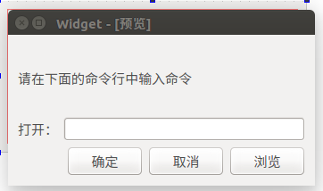

# Qt_Study
* 基本的类
QTabWidget 菜单选项卡  
QLable 标签  
QTextEdit 多行编辑器  
QLineEdit 单行编辑器  
QPushButton 按钮  
QGroupBox 组栏  
QTableWidget 表格  
QCheckBox  选择框  
QRadioButton 单选框  
QHBoxLayout 水平布局  
QVBoxLayout 垂直布局  
* 常用的快捷键
Ctrl+H 水平布局,也可以给整个Widget水平布局，这样在窗口大小变化的时候，部件跟着变化  
Ctrl+L 垂直布局  
Shift+Alt+R 预览  
this->setMaximumSize(393,187);固定最大的窗口大小  
this->setMinimumSize(393,187);固定最小的窗口大小  
* QProcess的使用
QProcess *process=new QProcess;//新建一个程序进程   
QString StartProcessString=ui->cmdLineEdit->text();//获取文本编辑器里的内容，即需要启动程序的名字  
process->start(StartProcessString.trimmed());//开始启动，trimmed()是去掉文本最后的空格  
* returnPressed()用法  
QObject::connect(ui->cmdLineEdit,SIGNAL(returnPressed()),this,SLOT(on_submitButton_clicked()));   
是一个LineEdit信号，当回车按下触发信号。
* 本例程的效果  
在文本编辑器里面输入gedit即可打开文本  

