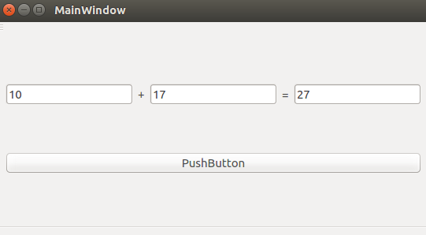

# Qt_Study
* Widget和MainWindow的区别：
Widget没有菜单栏，MainWindow有菜单栏
* 常用类的用法  
```
int first=ui->firstLineEdit->text().toInt();//取第一个文本编辑器的值，并转换成int类型  
int second=ui->secondLineEdit->text().toInt();//取第二个文本编辑器的值，并转换成int类型  
int result=first+second;  
ui->valLineEdit->setText(QString::number(result));//把结果在第三个文本编辑器里面显示出来，用setText方法，并且需要转换成string类型  
```


* 效果展示  


