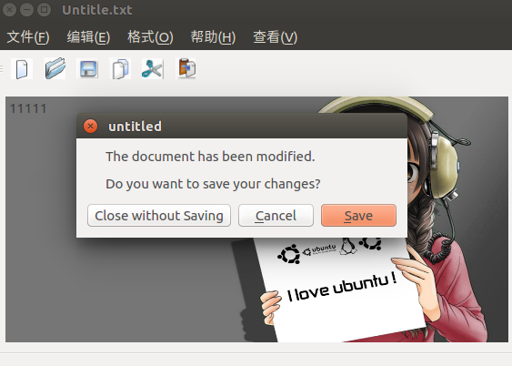

# Qt_Study
* Widget和MainWindow的区别：
Widget没有菜单栏，MainWindow有菜单栏
* 常用类的用法  
```
int first=ui->firstLineEdit->text().toInt();//取第一个文本编辑器的值，并转换成int类型  
int second=ui->secondLineEdit->text().toInt();//取第二个文本编辑器的值，并转换成int类型  
int result=first+second;  
ui->valLineEdit->setText(QString::number(result));//把结果在第三个文本编辑器里面显示出来，用setText方法，并且需要转换成string类型  
```


`ui->comboBox->currentIndex();//返回下拉框的索引值`

```
QMessageBox::warning(this,"WARNING","Second can't be zero");//警告对话框
QMessageBox::information(this,"RESULT",QString::number(result));//信息对话框
```

`qDebug()<<"The current file is modified.";//Qt自带的调试打印，需要添加#include <QtDebug>`  
action的一个常用信号：triggered(bool)；表示这个action被按下。  
`this->setWindowTitle("Untitle.txt");//设置窗口的标题，这里不用ui，我的理解是ui是界面内，this表示这个界面`  

* 效果展示  
  

