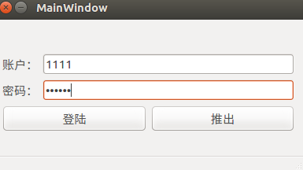

# Qt_Study
* 加密的登陆界面
`ui->passewordLineEdit->setEchoMode(QLineEdit::Password);//输入是加密的模式`
```
void MainWindow::on_pushButton_clicked()
{
    if(ui->usrLineEdit->text()=="1"&&ui->passewordLineEdit->text()=="1")//用text()方法取出编辑器里面的文本
    {
        QMessageBox::information(this,"congratulation","登陆。。。");
    }
    else
    {
        QMessageBox::information(this,"Error","请输入正确的帐号和密码");
        return;
    }
}

```
* 效果图  


