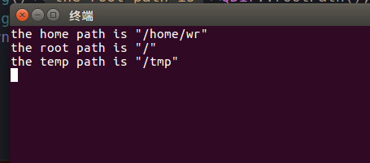

# Qt_Study
* 获取路径
```
qDebug()<<"the home path is"<<QDir::homePath();//home目录
qDebug()<<"the root path is"<<QDir::rootPath();//根目录
qDebug()<<"the temp path is"<<QDir::tempPath();//临时文件目录
```
* 效果   


