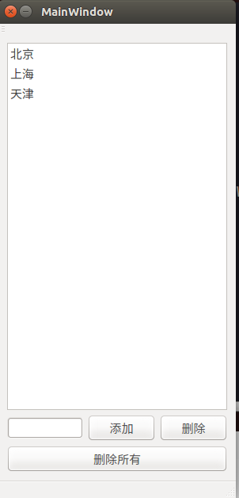

# Qt_Study
* Widget和MainWindow的区别：
Widget没有菜单栏，MainWindow有菜单栏
* 常用类的用法  
```
int first=ui->firstLineEdit->text().toInt();//取第一个文本编辑器的值，并转换成int类型  
int second=ui->secondLineEdit->text().toInt();//取第二个文本编辑器的值，并转换成int类型  
int result=first+second;  
ui->valLineEdit->setText(QString::number(result));//把结果在第三个文本编辑器里面显示出来，用setText方法，并且需要转换成string类型  
```


`ui->comboBox->currentIndex();//返回下拉框的索引值`

```
QMessageBox::warning(this,"WARNING","Second can't be zero");//警告对话框
QMessageBox::information(this,"RESULT",QString::number(result));//信息对话框
```

`qDebug()<<"The current file is modified.";//Qt自带的调试打印，需要添加#include <QtDebug>`  
action的一个常用信号：triggered(bool)；表示这个action被按下。  
`this->setWindowTitle("Untitle.txt");//设置窗口的标题，这里不用ui，我的理解是ui是界面内，this表示这个界面`  
* 打开一个文件的操作
```
#include <QFile>
#include <QFileDialog>
#include <QDir>
#include <QTextStream>
    QString fileName=QFileDialog::getOpenFileName(this,"Open Files",QDir::currentPath());//用对话框打开当前目录下的文件
    qDebug()<<"The file name is "<<fileName;//调试打印信息，文件的名称
    if(fileName.isEmpty())//如果没有打开
    {
        QMessageBox::information(this,"Error information","Please select a exit file;");//用QMessageBox对话框打印错误信息
        return;
    }
    QFile *file=new QFile;//新建一个file
    file->setFileName(fileName);//设置文件名称
    bool ok =file->open(QIODevice::ReadOnly);//open方法打开file，并设置权限为readonly
    if(ok)
    {
        QTextStream in(file);//文件与文本流相关联
        ui->textEdit->setText(in.readAll());//读出当前文本的所有的内容
        file->close();//关掉file
        delete file;//释放file
    }
    else
    {
        QMessageBox::information(this,"Error","file open error"+file->errorString());
    }
```
* 保存文件的操作
```
void MainWindow::saveFileSlot()
{
    if(saveFileName.isEmpty())
    {
        this->saveAsFileSlot();
    }
    QFile *file=new QFile;
    file->setFileName(saveFileName);
    bool ok=file->open(QIODevice::WriteOnly);
    if(ok)
    {
        QTextStream out(file);//使用out方法将文件和文件流相关联
        out<<ui->textEdit->toPlainText();//取出纯文本
        file->close();
        this->setWindowTitle(saveFileName);
        delete file;
    }
    else
    {
        QMessageBox::information(this,"Error","save file error"+file->errorString());
        return;
    }
}
void MainWindow::saveAsFileSlot()
{
    saveFileName=QFileDialog::getSaveFileName(this,"save file",QDir::currentPath());//弹出对话框，选择保存文件的位置和名字
    if(saveFileName.isEmpty())
    {
        QMessageBox::information(this,"Error","Please select a file;");
        return;
    }
    QFile *file=new QFile;//新建文件
    file->setFileName(saveFileName);//设置文件名字
    bool ok=file->open(QIODevice::WriteOnly);//open方法打开文件，并设置权限为只写
    if(ok)
    {
        QTextStream out(file);//使用out方法将文件和文件流相关联
        out<<ui->textEdit->toPlainText();//取出纯文本
        file->close();
        this->setWindowTitle(saveFileName);
        delete file;
    }
    else
    {
        QMessageBox::information(this,"Error","save file error"+file->errorString());
        return;
    }
}
```
* 设置颜色和字体
```
#include <QFont>
#include <QFontDialog>
#include <QColor>
#include <QColorDialog>
#include <QDateTime>
void MainWindow::setFontSlot()
{
    bool ok;
    QFont font=QFontDialog::getFont(&ok,this);//从字体对话框获取字体
    if(ok)//ok判断获取是否成功
    {
        ui->textEdit->setFont(font);//对文本编辑器里选中的字体进行设置
    }
    else
    {
        QMessageBox::information(this,"Error","please select a font;");
        return;
    }
}
void MainWindow::setColorSlot()
{
    QColor color=QColorDialog::getColor(Qt::red,this);
    if(color.isValid())
    {
        ui->textEdit->setTextColor(color);
    }
    else
    {
        QMessageBox::information(this,"Error","Error set color");
        return;
    }
}

```
* 关于编辑常用的槽函数
```
QObject::connect(ui->undoAction,SIGNAL(triggered(bool)),ui->textEdit,SLOT(undo()));
QObject::connect(ui->redoAction,SIGNAL(triggered(bool)),ui->textEdit,SLOT(redo()));
QObject::connect(ui->copyAction,SIGNAL(triggered(bool)),ui->textEdit,SLOT(copy()));
QObject::connect(ui->pasteAction,SIGNAL(triggered(bool)),ui->textEdit,SLOT(paste()));
QObject::connect(ui->cutAction,SIGNAL(triggered(bool)),ui->textEdit,SLOT(cut()));
QObject::connect(ui->selectAllAction,SIGNAL(triggered(bool)),ui->textEdit,SLOT(selectAll()));
```
* 获得时间的方法
```
void MainWindow::currentTimeSlot()
{
    QDateTime current=QDateTime::currentDateTime();//获得当前的时间
    QString time=current.toString("yyyy-M-d hh:mm:ss");//转换成string，按照一定的格式
    ui->textEdit->append(time);//在末尾追加
}
```
* 关闭事件处理
```
void MainWindow::closeEvent(QCloseEvent *event)
{
    if(ui->textEdit->document()->isModified())
    {

  QMessageBox msgBox;
  msgBox.setText("The document has been modified.");
  //显示的文本
  msgBox.setInformativeText("Do you want to save your changes?");
  //需要你做的操作
  msgBox.setStandardButtons(QMessageBox::Save | QMessageBox::Discard | QMessageBox::Cancel);
  //三个按钮
  msgBox.setDefaultButton(QMessageBox::Save);
  //默认的按钮
  int ret = msgBox.exec();//对话框关闭的时候返回你操作的结果
  switch (ret) {
      case QMessageBox::Save:
          // Save was clicked
          this->saveFileSlot();
          break;
      case QMessageBox::Discard:
          // Don't Save was clicked
          event->accept();
          break;
      case QMessageBox::Cancel:
          // Cancel was clicked
          event->ignore();
          break;
      default:
          // should never be reached
          event->ignore();
          break;
    }

    }
    else
    {
        event->accept();
    }
}
```
* ListWidget的用法
```
void MainWindow::addItemSlot()//添加项目
{
    QString cityName=ui->cityLineEdit->text();//从文本编辑器里面获得内容
    if(cityName.isEmpty())//判断是否为空
    {
        return;
    }
    QListWidgetItem *item=new QListWidgetItem;//新建项目
    item->setText(cityName);//设置项目内容
    ui->listWidget->addItem(item);//添加项目
    ui->cityLineEdit->clear();

}
void MainWindow::deleteItemSlot()
{
    QListWidgetItem *item=ui->listWidget->takeItem(ui->listWidget->currentRow());
    delete item;
}
void MainWindow::deleteAllItemSlot()
{
    int count=ui->listWidget->count();
    for(int index=0;index<count;index++)
    {
        QListWidgetItem *item=ui->listWidget->takeItem(0);
        delete item;
    }
}
```
* 效果展示  
  

