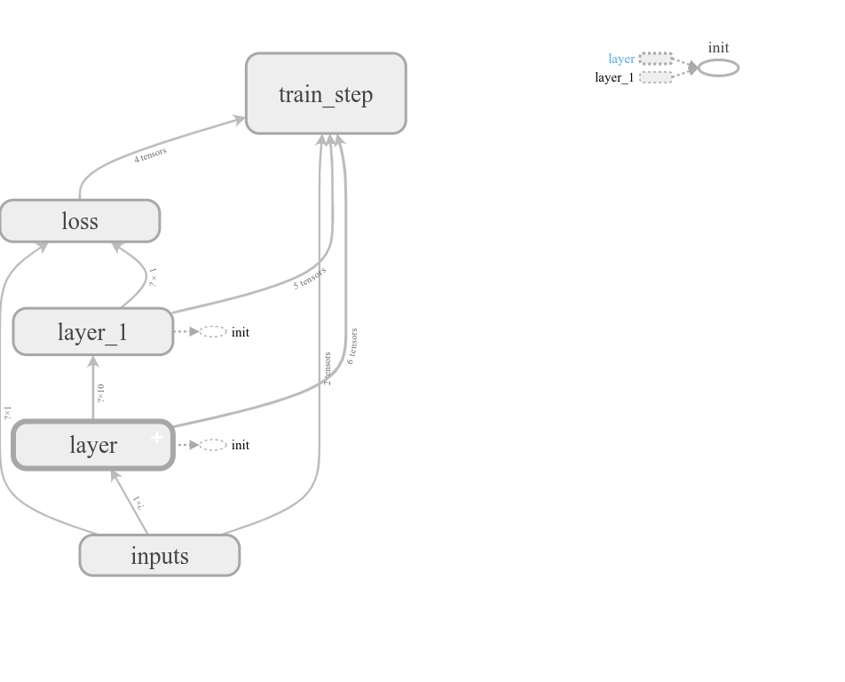

# 机器学习 #
## 机器学习分类 ##
- 神经网络  
	神经网络主要有3种：
	1. 监督学习：有数据和标签信息
	2. 非监督学习：不提供标签信息，只有数据
	3. 半监督学习：有数据和部分的标签
- 强化学习  
	从经验中总结提升，分数导向，和监督学习差不多
	主要有3种分类：
	1. 通过价值选行为：Q learning、Sarsa和Deep Q Network
	2. 直接选行为：Policy Gradients
	3. 想象环境并从中学习：Model based RL
- 遗传算法  
	适者生存，不适者淘汰

## 神经网络学习框架 ##
- tensorflow  
	构建过程如下：
	1. 造数据
	2. 搭建框架  
		构建网络：一般构建两层神经网络，定义好输入神经元个数，输出神经元个数     
		定义损失函数：样本的真实值和网络预测值的差别  
		优化方法：梯度下降法  
		初始化：  
		`变量tf.Variable(0,name='counter')`     
		`常量one=tf.constant(1)`     
		`加法new_value=tf.add(state,one)`  
		`更新update=tf.assign(state,new_value)`  
		`初始化init=tf.initialize_all_variables()`
	3. 开始训练  
		Session的两种使用方法： 
		``` 
		sess=tf.Session()
		result=sess.run(product)
		```
		```
		with tf.Session() as sess1:
		   result2=sess1.run(product)
		```
	4. 示例
		```
		import tensorflow as tf
		import numpy as np
		import matplotlib.pyplot as plt
		def add_layer(inputs,in_size,out_size,activation_function=None):
    		Weights=tf.Variable(tf.random_normal([in_size,out_size]))
    		biases=tf.Variable(tf.zeros([1,out_size])+0.1)
    		Wx_plus_b=tf.matmul(inputs,Weights)+biases
    		if activation_function is None:
        		output=Wx_plus_b
    		else:
        		output=activation_function(Wx_plus_b)
    		return output
		x_data=np.linspace(-1,1,300)[:,np.newaxis]
		noise=np.random.normal(0,0.05,x_data.shape)
		y_data=np.square(x_data)-0.5+noise
		xs=tf.placeholder(tf.float32,[None,1])
		ys=tf.placeholder(tf.float32,[None,1])
		l1=add_layer(xs,1,10,activation_function=tf.nn.relu)
		predition=add_layer(l1,10,1,activation_function=None)
		loss=tf.reduce_mean(tf.reduce_sum(tf.square(ys-predition),reduction_indices=[1]))
		train_step=tf.train.GradientDescentOptimizer(0.1).minimize(loss)
		init=tf.initialize_all_variables()
		sess=tf.Session()
		sess.run(init)
		fig=plt.figure()
		ax=fig.add_subplot(1,1,1)
		ax.scatter(x_data,y_data)
		plt.ion()
		plt.show()
		for i in range (1000):
    		#print(sess.run(loss,fe))
    		sess.run(train_step,feed_dict={xs:x_data,ys:y_data})
    		if i%50 ==0:
        		#print(sess.run(loss,feed_dict={xs:x_data,ys:y_data}))
        		try:
            		ax.lines.remove(lines[0])
        		except Exception:
            		pass
        		predition_value=sess.run(predition,feed_dict={xs:x_data})
        		lines=ax.plot(x_data,predition_value,'r-',lw=5)
        		plt.pause(0.1)
		```
	4. 加速训练
		选择不同的优化方法，可以加速训练收敛速度，常见的优化方法有：SGD、Momentum、AdaGrad和RMSProp
	5. 可视化  
		
	6. 激励函数
		激励函数一般是可微分的函数，常用的有：relu卷积神经网络和循环神经网络、sigmoid、tanh循环神经网络
	7. 训练结果保存
		保存的方法：  
		```
		import tensorflow as tf
		import numpy as np
		W = tf.Variable([[1,2,3],[3,4,5]], dtype=tf.float32, name='weights')
		b = tf.Variable([[1,2,3]], dtype=tf.float32, name='biases')
		tf.initialize_all_variables()
		saver = tf.train.Saver()
		with tf.Session() as sess:
   			sess.run(tf.initialize_all_variables())
   			save_path = saver.save(sess, "/home/wr/study/save_net.ckpt")
   			print("Save to path: ", save_path)
		```	
		加载参数的方法：
		```
		import tensorflow as tf
		import numpy as np
		W = tf.Variable(np.arange(6).reshape((2, 3)), dtype=tf.float32, name="weights")
		b = tf.Variable(np.arange(3).reshape((1, 3)), dtype=tf.float32, name="biases")
		saver = tf.train.Saver()
		with tf.Session() as sess:
    		saver.restore(sess, "/home/wr/study/save_net.ckpt")
    		print("weights:", sess.run(W))
    		print("biases:", sess.run(b))
		```
		
- pytorch

## tensorflow学习实例 ##
- 分类学习神经网络
	建立两层神经网络，激励函数选择：softmax；损失函数定义:loss_entropy=tf.reduce_mean(tf.reduce_sum(ys*tf.log(prediction),reduction_indices=[1]))；过拟合处理:Wx_plus_b = tf.nn.dropout(Wx_plus_b, keep_prob)
- 卷积神经网络CNN
	1. conv1 layer：一次卷积和一次池化
	```
	W_conv1 = weight_variable([5,5, 1,32]) # patch 5x5, in size 1, out size 32
	b_conv1 = bias_variable([32])
	h_conv1 = tf.nn.relu(conv2d(x_image, W_conv1) + b_conv1) 
	h_pool1 = max_pool_2x2(h_conv1)          
	```
	2. conv2 layer：一次卷积和一次池化
	```
	W_conv2 = weight_variable([5,5, 32, 64]) # patch 5x5, in size 32, out size 64
	b_conv2 = bias_variable([64])
	h_conv2 = tf.nn.relu(conv2d(h_pool1, W_conv2) + b_conv2) 
	h_pool2 = max_pool_2x2(h_conv2)         
	```
	3. fc1 layer：卷积完后,拍平,建立一层隐藏层
	```
	W_fc1 = weight_variable([7*7*64, 1024])
	b_fc1 = bias_variable([1024])
	h_pool2_flat = tf.reshape(h_pool2, [-1, 7*7*64])
	h_fc1 = tf.nn.relu(tf.matmul(h_pool2_flat, W_fc1) + b_fc1)
	h_fc1_drop = tf.nn.dropout(h_fc1, keep_prob)
	```
	4. fc2 layer：
	```
	W_fc2 = weight_variable([1024, 10])
	b_fc2 = bias_variable([10])
	prediction = tf.nn.softmax(tf.matmul(h_fc1_drop, W_fc2) + b_fc2)
	```
- 循环神经网络RNN:LSTM RNN
	
	1. add_input_layer
	```
	l_in_x = tf.reshape(self.xs, [-1, self.input_size], name='2_2D')  # (batch*n_step, in_size)
	Ws_in = self._weight_variable([self.input_size, self.cell_size])
	bs_in = self._bias_variable([self.cell_size,])
	with tf.name_scope('Wx_plus_b'):
	l_in_y = tf.matmul(l_in_x, Ws_in) + bs_in
	self.l_in_y = tf.reshape(l_in_y, [-1, self.n_steps, self.cell_size], name='2_3D')
	```
	2. add_cell
	```
	lstm_cell = tf.contrib.rnn.BasicLSTMCell(self.cell_size, forget_bias=1.0, state_is_tuple=True)
	with tf.name_scope('initial_state'):
	self.cell_init_state = lstm_cell.zero_state(self.batch_size, dtype=tf.float32)
	self.cell_outputs, self.cell_final_state = tf.nn.dynamic_rnn(
	lstm_cell, self.l_in_y, initial_state=self.cell_init_state, time_major=False)
	```
	3. add_output_layer
	```
	l_out_x = tf.reshape(self.cell_outputs, [-1, self.cell_size], name='2_2D')
	Ws_out = self._weight_variable([self.cell_size, self.output_size])
	bs_out = self._bias_variable([self.output_size, ])
	with tf.name_scope('Wx_plus_b'):
		self.pred = tf.matmul(l_out_x, Ws_out) + bs_out
	```
	